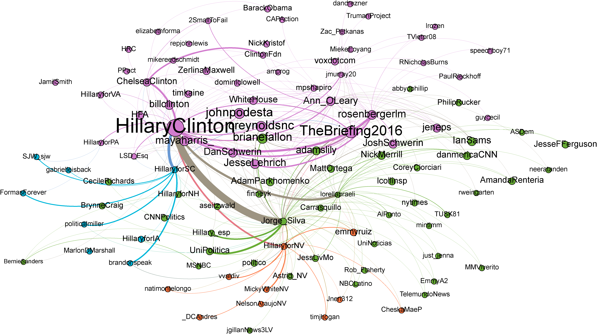

# Data Repo for INST 633 Final Project

[INST 633 final project](http://www.cs.umd.edu/~golbeck/INST633o/final.shtml)

## Retweet Network

| Top 10 Retweets (RTs) ||||
| --- | --- | --- | ---|
| *@HillaryClinton*  || *@realDonaldTrump* ||
| @thebriefing2016 | 83 | @EricTrump | 16 |
| @HFA | 52 | @DonaldJTrumpJr | 9 |
| @timkaine | 23 | @DRUDGE_REPORT | 8 |
| @mayaharris_ | 16 | @JoeNBC | 5 |
| @ann_oleary | 14 | @piersmorgan | 4 |
| @hillary_esp | 13 | @DanScavino | 4 |
| @johnpodesta | 11 | @AnnCoulter | 4 |
| @ChelseaClinton | 9 | @seanhannity | 3 |
| @rosenbergerlm | 8 | @RealBenCarson | 3 |
| @billclinton | 8 | @foxandfriends | 3 |


  
Hillary Clinton Twitter RT visualization

  
Donald J. Trump Twitter RT visualization

## Mention Network

| Top 10 Mentions(@) ||||
| --- | --- | --- | ---|
| *@HillaryClinton* || *@realDonaldTrump* ||
| @POTUS | 115 | @realDonaldTrump | 347 |
| @realDonaldTrump | 83 | @FoxNews | 105 |
| @timkaine | 45 | @CNN | 97 |
| @billclinton | 33 | @megynkelly | 59 |
| @BernieSanders | 31 | @JebBush | 49 |
| @JoeBiden | 17 | @nytimes | 40 |
| @FLOTUS | 17 | @oreillyfactor | 32 |
| @elizabethforma | 16 | @seanhannity | 27 |
| @GOP | 10 | @foxandfriends | 26 |
| @CoryBooker | 9 | @tedcruz | 23 |

  
Hillary Clinton Twitter mention visualization

  
Donald J. Trump Twitter mention visualization


